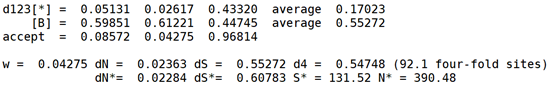
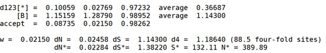

**Solution.**

Following Exercise 2.1 in (Yang, 2014), I download the sequences of the
gene coding for NADH6 of *Homo sapiens* and *Pongo pygmaeus* from their
mitochondrial genome sequences (Accession: X93334 and D38115
respectively). Note that to translate the CDS of human one into amino
acids the reverse complement may be needed. Then, alignment the amino
acid sequences using MAFFT (Katoh & Standley, 2013), and construct the
DNA alignment based on the protein alignment with PAL2NAL (Suyama et
al., 2006).

Then use CODEML to get the results. The following shows my settings of
the file *codeml.ctl*. Note that in the control file *codeml.ctl* you
need to set icode=1 which represents the codon table 1, i.e., the one
used in mammalian mitochondria. Kappa is set to zero which means it is
estimated rather than fixed.


```Bash
$ mafft AA.fas > AA.aln
$ pal2nal.pl AA.aln DNA.fas -output paml -codontable 2 > DNA.paml
$ codeml codeml.ctl
```

The estimates for $d_{S}$, $d_{N}$, $d_{1B}$, $d_{2B}$, $d_{3B}$,
$d_{S^\*}$, and $d_{N^\*}$ by using different models are displayed
as follows which are directly obtained from CODEML's output.

Fequal:


F1X4:


F3X4:



F61:



FMutSel:


