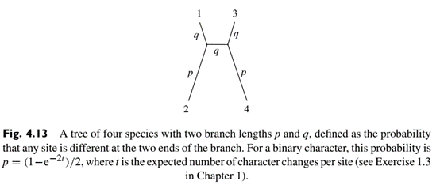

**Solution.**

<p align="center">
  
</p>

As to a four-tip tree, there are three possible tree topologies. They
are depicted as *xxyy*, *xyxy*, and *xyyx*, which correspond to
((1,2),3,4), ((1,3),2,4), ((1,4),2,3), respectively.

<p align="center">
  
</p>

For tree reconstruction using the most parsimonious (MP) method, only
sites with the patterns where two sites have the same nucleotide while
the other two have another same nucleotide such as TTCC or TATA, are
informative. In other words, a site in the alignment with any other
patterns such as AAAA or ATGG do not provide any information to
distinguish between any of the possible trees because all of them are
equally likely. There have to be at least two nucleotides each occurring
twice at least. See Section 3.4 in (Yang, 2006) for more details.

Denote the state at node $i$ as $S_{i}$. Hence,

$$P\left( S_{0} \right) = P\left( S_{1} \right) = ... = P\left( S_{5} \right) = 0.5.$$

The probability of observing the pattern $xxyy$ by the MP method can be
calculated as

$$
\begin{align*}
P(xxyy) &= P(S_{1} = A,S_{2} = A,S_{3} = B,S_{4} = B) + P(S_{1} = B,S_{2} = B,S_{3} = A,S_{4} = A) \\
&= 0.5\sum_{s_{0} \in \\{ A,B \\}}^{}\left( P(S_{1} = A,S_{2} = A,S_{3} = B,S_{4} = B|S_{0} = s_{0}) + P(S_{1} = B,S_{2} = B,S_{3} = A,S_{4} = A|S_{0} = s_{0}) \right) \\
&= 2 \times 0.5 \times \\left( P(S_{1} = A,S_{2} = A,S_{3} = B,S_{4} = B|S_{0} = A) + P(S_{1} = B,S_{2} = B,S_{3} = A,S_{4} = A|S_{0} = A) \\right) \\
&= P(S_{1} = A,S_{2} = A,S_{3} = B,S_{4} = B|S_{0} = A) + P(S_{1} = B,S_{2} = B,S_{3} = A,S_{4} = A|S_{0} = A) \\
&= P(S_{1} = A,S_{2} = A,S_{3} = B,S_{4} = B,S_{5} = A|S_{0} = A) + P(S_{1} = A,S_{2} = A,S_{3} = B,S_{4} = B,S_{5} = B|S_{0} = A) \\
&\quad + P(S_{1} = B,S_{2} = B,S_{3} = A,S_{4} = A,S_{5} = A|S_{0} = A) + P(S_{1} = B,S_{2} = B,S_{3} = A,S_{4} = A,S_{5} = B|S_{0} = A) \\
&= (1 - q)(1 - p)(1 - q)qp + (1 - q)(1 - p)q(1 - q)(1 - p) + qp(1 - q)(1 - q)(1 - p) + qpqpq \\
&= 2p^{2}q^{2} - p^{2}q + (q^{3} - 2q^{2} + q).
\end{align*}
$$

Likewise, calculate the probability of obtaining the pattern *xyxy* as

$$
\begin{align*}
P(xyxy) &= P\left( S_{1} = A,S_{2} = B,S_{3} = A,S_{4} = B \right) + P\left( S_{1} = B,S_{2} = A,S_{3} = B,S_{4} = A \right) \\
&= 2 \times 0.5 \times \left( P\left( S_{1} = A,S_{2} = B,S_{3} = A,S_{4} = B|S_{0} = A \right) + P\left( S_{1} = B,S_{2} = A,S_{3} = B,S_{4} = A|S_{0} = A \right) \right) \\
&= (1 - q)p(1 - q)(1 - q)p + (1 - q)pqq(1 - p) + q(1 - p)(1 - q)q(1 - p) + q(1 - p)q(1 - q)p \\
&= 2\left( p^{2}q^{2} \right) - 3\left( p^{2}q \right) + p^{2} + \left( q^{2} - q^{3} \right).
\end{align*}
$$

and the probability of obtaining the pattern *xyyx* as

$$
\begin{align*}
P(xyyx) &= P\left( S_{1} = A,S_{2} = B,S_{3} = B,S_{4} = A \right) + P\left( S_{1} = B,S_{2} = A,S_{3} = A,S_{4} = B \right) \\
&= (1 - q)p(1 - q)q(1 - p) + (1 - q)pq(1 - q)p + q(1 - p)(1 - q)(1 - q)p + q(1 - p)qq(1 - p) \\
&= 2\left( p^{2}q^{2} \right) - p^{2}q - \left( 4pq^{2} - 2pq \right) + q^{3}.
\end{align*}
$$

According to the context of the problem, calculate the difference
between $P(xxyy)$ and $P(xyxy)$ as

$$
\begin{align*}
P(xxyy) - P(xyxy) &= \left( 2p^{2}q^{2} - p^{2}q + \left( q^{3} - 2q^{2} + q \right) \right) - \left( 2\left( p^{2}q^{2} \right) - 3\left( p^{2}q \right) + p^{2} + \left( q^{2} - q^{3} \right) \right) \\
&= (2q - 1)\left( p^{2} - q + q^{2} \right).
\end{align*}
$$


Note that from Exercise 1.3 in (Yang, 2006) the range of $p$ and $q$ are
both $\lbrack 0, + \infty)$. Specifically, it is discerned that the
minimum value of *p* is rendered as 0, whereas the upper limit of p
converges to 1/2 with the progression of time (*t*) towards infinity
$\max(p) = \lim_{t \rightarrow \infty}{\frac{1}{2}\left( 1 - e^{- 2t} \right)} = \frac{1}{2}$
(the same for $q$). Accordingly, $2q - 1 < 0$. Hence, if and only if
$p^{2} - q + q^{2} > 0$ thus $q(1 - q) < p^{2}$, $P(xxyy) < P(xyxy)$
holds.


```R
> library(Ryacas0)
> p<-Sym(“p”); q<-Sym(“q”)
> f1 <- Simplify( ryacas(expression((1-q)*(1-p)*(1-q)*q*p+(1-q)*(1-p)*q*(1-q)*(1-p)+q*p*(1-q)*(1-q)*(1-p)+q*p*q*p*q)) )
> f2<- Simplify( ryacas(expression((1-q)*p*(1-q)*(1-q)*p+(1-q)*p*q*q*(1-p)+q*(1-p)*(1-q)*q*(1-p)+q*(1-p)*q*(1-q)*p)) )
> f3<-Simplify( ryacas(expression((1-q)*p*(1-q)*q*(1-p)+(1-q)*p*q*(1-q)*p+q*(1-p)*(1-q)*(1-q)*p+q*(1-p)*q*q*(1-p))) ) # not used in this exercise
> f1-f2
```
