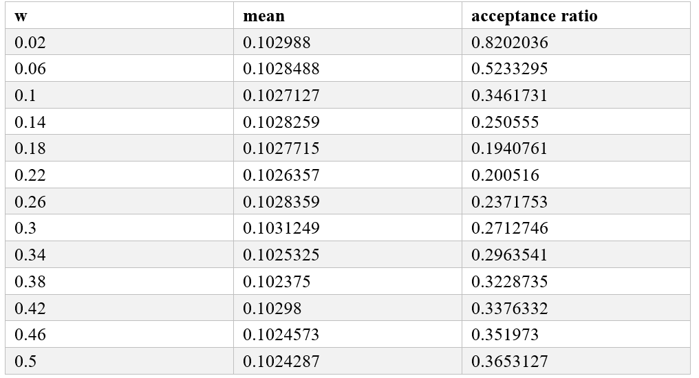
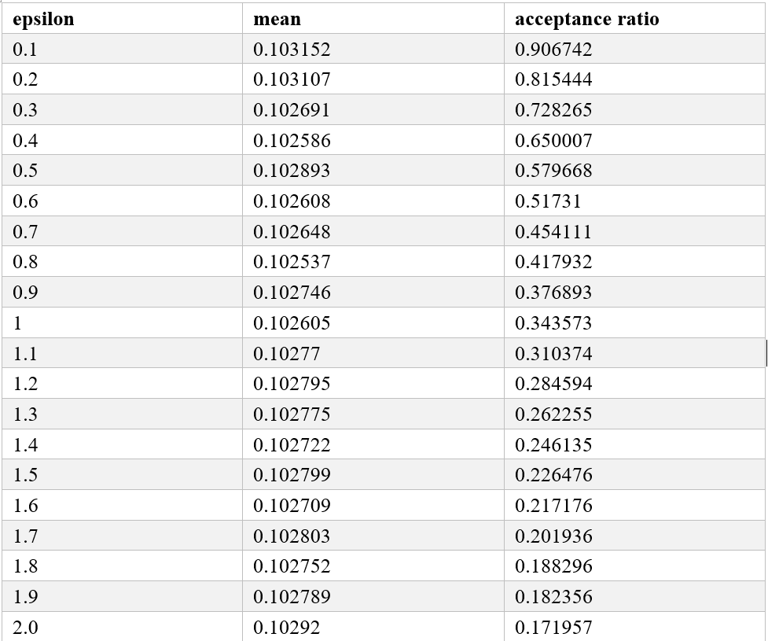

**Solution.**

Download the mitochondrial genome sequences for human (D38112) and
orangutan (NC_001646), and extract the 12s rRNA gene. Align them using
your favorite software. However, I am lazy enough to take the
precalculated values provided in Section 5.3.2 of (Yang, 2006).
Accordingly, the number of aligned sites $n$ = 948, the number of
different sites $x$ = 90. Consider a uniform proposal and a flat prior
of $\theta$.

\(a\) According to Eq. (5.32) of (Yang, 2006), the new state
$\theta^{*}$ is drawn from a uniform distribution
$U\left( \theta - \frac{w}{2},\theta + \frac{w}{2} \right)$. The
likelihood function is given as Eq. (1.42) of (Yang, 2006):

$$L(\theta;x) = f(x|\theta) = \begin{pmatrix}
n \\
x \\
\end{pmatrix}\left( \frac{3}{4} - \frac{3}{4}e^{- \frac{4}{3}d} \right)^{x}\left( \frac{1}{4} + \frac{3}{4}e^{- \frac{4}{3}d} \right)^{n - x}.$$

Because a flat prior of $\theta$ is adopted (see above), the acceptance
ratio can be simplified as

$$\alpha = \min\left( 1,\frac{L\left( \theta^{*};x \right)}{L(\theta;x)} \right).$$

The MCMC sampling may be performed using the following R code
(*5.4a.R*).

```R
#! /usr/bin/env Rscript


########################################
# assume branch_length ~ Uniform(0,10)
lnprior_unif <- function(d){
	log(dunif(d,0,10))
}

lnl_JC69 <- function(d, n, x){
    x*log(3/4-3/4*exp(-4/3*d)) + (n-x)*log(1/4+3/4*exp(-4/3*d))
}

do_mcmc <- function(w, nsample, n, x){
    ds <- numeric(nsample)
    accepts <- numeric(nsample)
    d <- 0.8
	
	# log-prior
	lnprior <- lnprior_unif(d)
	
	# log-likelihood
	lnl <- lnl_JC69(d, n, x)
	
	# log-posterior
	lnposterior <- lnprior + lnl
	
    for(i in 2:nsample){
        d_new <- runif(1, d-w/2, d+w/2)
        d_new <- ifelse(d_new>=0, d_new, d)
		
        lnposterior_new <- lnprior_unif(d_new) + lnl_JC69(d_new, n, x)
        alpha <- min(1, exp(lnposterior_new-lnposterior))
        if(runif(1) < alpha){
            d <- d_new
            lnposterior <- lnposterior_new
            accepts[i] <- 1
        }
        ds[i] <- d
    }
    return(list(ds=ds, accepts=accepts))
}


########################################
x <- 90; n<-948
w <- 0.3; nsample <- 10000

for(w in seq(0.02,0.5,0.04)){
    res <- do_mcmc(w=w, nsample=nsample, n=n, x=x)
    ds <- res$ds; accepts <- res$accepts
    burnin <- round(nsample/2)
    ds_after_burnin <- ds[burnin:nsample]
    accepts_after_burnin <- accepts[burnin:nsample]
    acceptance_ratio <- length(accepts_after_burnin[accepts_after_burnin==1])/length(accepts_after_burnin)
    cat(w, mean(ds_after_burnin), acceptance_ratio, '\n', sep="\t")
}
```

The result is displayed as follows.
<p align="center">
  
</p>

\(b\) The proportional shrinking and expanding algorithm is introduced
in Section 5.4.4 in (Yang, 2006). The proposal ratio is

<p align="center">
    
</p>

Accordingly, the acceptance ratio is calculated as

$$\alpha = \min{\left( 1,\frac{L\left( \theta^{*};x \right)}{L(\theta;x)} \times c \right),}$$

where $c = e^{\epsilon(r - 0.5)}$ and $r\sim U(0,1)$.

For simplicity, I do not show the R code here but interested readers can use
the script *5.4b.R* available along with the solutions manual to generate the result highly similar to the
following.
<p align="center">
  
</p>
