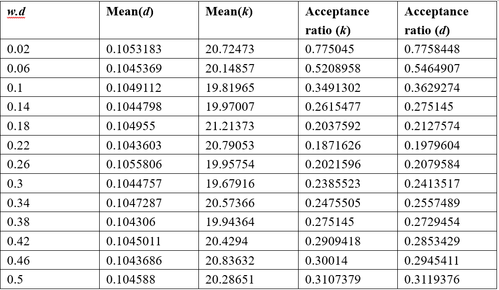

**Solution.**

Refer to Section 1.4.2 of (Yang, 2006) to get the number of transitions
$n_{S} = 84$, and the number of transversions $n_{V} = 6$. The
log-likelihood function is given by Eq. (1.48) in (Yang, 2006) as

$$\mathcal{l}\left( d,k \middle| n_{S},n_{V} \right) = \left( n - n_{S} - n_{V} \right)\log\left( \frac{p_{0}}{4} \right) + n_{S}\log\left( \frac{p_{1}}{4} \right) + n_{V}\log\left( \frac{p_{2}}{4} \right),$$

where

$$p_{0}(t) = \frac{1}{4} + \frac{1}{4}e^{- \frac{4d}{\kappa + 2}} + \frac{1}{2}e^{- \frac{2d(\kappa + 1)}{\kappa + 2}},$$

$$p_{1}(t) = \frac{1}{4} + \frac{1}{4}e^{- \frac{4d}{\kappa + 2}} - \frac{1}{2}e^{- \frac{2d(\kappa + 1)}{\kappa + 2}},$$

$$p_{2}(t) = \frac{1}{4} - \frac{1}{4}e^{- \frac{4d}{(\kappa + 2)}},$$

according to Eq. (1.10) of (Yang, 2006).

I fix the width of the sliding-window proposal for $k$ to be 10.
Interestingly, in a paper published 11 years after (Yang, 2006) was
published, the authors performed very detailed MCMC analysis of
estimates of the parameters on the same data set (Nascimento et al.,
2017), but note that they used different priors for $d$ and $k$ from
those used in the present example. The MCMC sampling may be performed
using the script *5.6.R*. My result is summarized as follows.

<p align="center">
  
</p>

To compare with the MLE, use the following R code which uses the
function *optim* to obtain the MLE. The result is
$\widehat{k} = 0.1045327$, $\widehat{d}\  = 30.8064718$. You can also
refer to the estimates given in Section 1.4.2 of (Yang, 2006).

```R
> mle <- optim(par=c(0.13,2), lnl_K80, n=948, ns=84, nv=6)
> print(mle$par)
```
