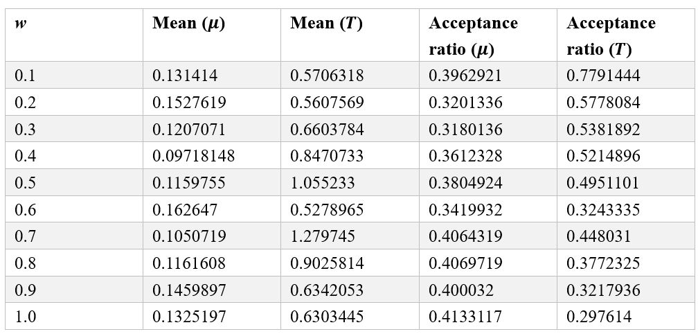

**Solution.**

Run the R script 5.5.R to get the following results. Note that the same window size $w$ is used for both rate and time. Another script associated with this exercise, which is a slightly modefied script originally contributed by Mario dos Reis, is also provided.

  

    
  

