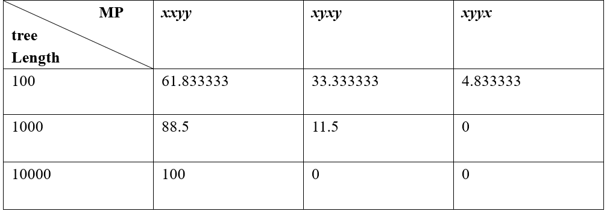

**Solution.**

Denote the state (nucleotide) at node $i$ as $S_{i}$ which can take
values $s_{i} \in \\{ T,C,A,G \\}$. $Under the model JC69, the
probability of observing $S_{1} = s_{1},\ldots,S_{4} = s_{4}$ where may
be calculated as

$$
\begin{align*}
P(S_{1} = s_{1}, S_{2} = s_{2}, S_{3} = s_{3}, S_{4} = s_{4}) &= \sum_{s_{7}}^{}{P(S_{0} = s_{0})P(S_{1}|S_{0} = s_{0})P(S_{3}|S_{0} = s_{0})P(S_{2},S_{4} | S_{0} = s_{0})}\\
&= 0.25\sum_{s_{0}}^{}{(P(S_{1}|S_{0} = s_{0})P(S_{3}|S_{0} = s_{0}))\sum_{s_{5}}^{}{P(S_{5}|S_{0})P(S_{2}|S_{5} = s_{5})P(S_{4}|S_{5} = s_{5})}}.
\end{align*}
$$

Use the following R code to, for each of the total sequence length of
100, 1000, and 10000 bases, conduct 1000 simulations of sequence
evolution. Then, the most parsimonious (MP) tree(s) inferred from each
simulation are summarized. In case where 2 and 3 MP trees are inferred,
each is counted as $1/2$ and $1/3$ respectively. The following R code
counts the three patterns *xxyy*, *xyxy*, and *xyyx*. See Section 3.4 in
(Yang, 2006) or Problem 4.3 in the book for more details in MP tree
reconstruction.

```R
sample2 <- function(d, base, nsamples=1){
    p0 <- 1/4 + 3/4*exp(-4*d/3)
    p1 <- (1-p0)/3
    bases <- c(base, setdiff(BASES, base))
    sample(bases, nsamples, prob=c(p0,rep(p1,3)), replace=T)
}

sim_seq <- function(l){
    seq <-  matrix(0, nrow=4, ncol=l)
    dimnames(seq) = list(paste0('S',1:4), paste0('site',1:l))
    for (i in 1:l){
        for(s0 in sample(BASES, 1, prob=rep(0.25,4), replace=T)){
            list2env( setNames(as.list(sample2(d=0.1, s0, nsamples=2)), paste0('s', c(1,5))), envir = .GlobalEnv )
            s3 <- sample2(d=0.5, s0)
            s2 <- sample2(d=0.1, s5)
            s4 <- sample2(d=0.5, s5)
            seq[1,i] <- s1
            seq[2,i] <- s2
            seq[3,i] <- s3
            seq[4,i] <- s4
        }
    }
    return(seq)
}

determine_mp <- function(x){
    if(identical(as.integer(table(x)), as.integer(c(2,2)))){
        if(x[1] == x[3]){
            'xxyy'
        } else if(x[1] == x[2]){
            'xyxy'
        } else if(x[1] == x[4]){
            'xyyx'
        }
    } else{
        return(NA)
    }
}

> BASES <- c("T", "C", "A", "G")

> for(l in c(100,1000,10000)){
    c_total <- numeric(3)
    names(c_total) <- c('xxyy', 'xyxy', 'xyyx')
    for(n in 1:100){
        seq_matrix <- sim_seq(l=l)
        pattern <- apply(seq_matrix, 2, determine_mp)
        count <- table(pattern[!is.na(pattern)])
        mp_index <- which(count == max(count))
        for(i in names(count[mp_index]) ){
            c_total[i] <- c_total[i] + 1/length(mp_index)
        }
    }
    print(c_total)
}
```

The result is as follows. *xxyy* means (1,3),(2,4), *xyxy* means
(1,2),(3,4), and *xyyx* means (1,4),(2.3).
<p align=center>
    
</p>
