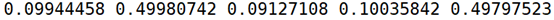

**Solution.**

Instead of using any software, use the following R code (***9.5.R***)
for branch length estimation. It is based on the famous Felsenstein's
pruning algorithm (Felsenstein, 1973). See also Section 4.2.2 in (Yang,
2006) for a detailed explanation of the algorithm. To use the R script,
please be aware that the following packages *getopt*, *parallel*,
*matrixStats*, *seqinr*, *expm*, *ape, phangorn* may need to be
installed.

Write the three possible tree topologies (1,2),(3,4), (1,3),(2,4),
(1,4),(2.3) into three files *1.nwk*, *1-2.nwk*, and *1-3.nwk*,
respectively. Now, run *9.5.R* by fixing the tree topology for each of
the three one by one and compare the log-likelihood. The MLEs of the
branch lengths of the tree with the highest likelihood are then compared
with the branch lengths used in simulation (*9.5.R*).

Simulate a sequence of $10^{6}$ nucleotide sites using the script
written for Exercise 9.4 and name the simulated alignment as *1.nwk*.
Then, for each of the three possible tree topologies, run the following
in Shell.

```Bash
for(tree in 1.nwk 1-2.nwk 1-3.nwk){
  echo $tree
  Rscript 9.5.R -t 1.nwk -s 1.aln --cpu 10
  echo
}
```

The log likelihood of using the three tree topologies are
respectively$\  - 4417007.5$, $- 4433276.3$, and $- 4433276.4$. Hence,
the first topology, thus the correct topology, is indicated as the best
tree. The branch length MLEs of using this tree topology are highly
similar to the parameters used in simulation:

<p>
  
</p>

Also confirm this using IQ-Tree (Minh et al., 2020) by the following
command in Shell where the MLEs of branch lengths can be found in the
file *iqtree.treefile* and the log-likelihood is indicated in the file
*iqtree.log* ($- 4417007.476$). Note that the script 9.5.R uses an 
algorithm that updates all branch lengths simultaneously in finding 
the MLEs, but most modern phylogenetics software instead implement other 
faster algorithms.

```Bash
iqtree -s 1.aln -m JC -redo -pre iqtree
```
