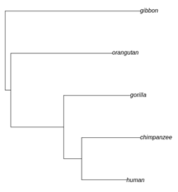

<p align="center">
  
</p>

**Solution.**

Use the following R code to find the pair of taxa most distant to each
other. The package *phytools* (Revell 2012) may need to be installed.

```R
library(phytools)
tree <- read.tree( text="(((human: 0.040, chimpanzee: 0.052): 0.016, gorilla: 0.059): 0.047, orangutan: 0.090, gibbon: 0.125);" )
which(dist.nodes(tree) == max(dist.nodes(tree)), arr.ind = TRUE)
tree$tip.label
```

This gives taxon 2 and taxon 5, which are chimpanzee and gibbon
respectively. Then use the R code to root the tree and visualize it.

```R
rooted_tree <- midpoint.root(tree)
plot(rooted_tree)
```

<p align="center">
  
</p>
