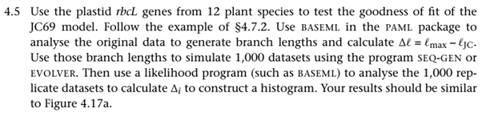

<p>
  
</p>

**Solution.**

<ins>Data preparation.</ins>

Download the alignment and the tree from Yang's website (Yang 2014b)
(see C2). Convert the alignment into FASTA format. Then, remove all
sites that have any ambiguous sites or gaps. See pp. 146 of (Yang
2014a):

\| *We do not have a model for alignment gaps, so we remove sites with
gaps, with 1,312 sites left*.

This should generate an alignment of 1312 bp, available in the file
"rbcL.nogaps_amb.fas".

<ins>Check the R script</ins>

I write the following R script to calculate log-likelihood under the
multinomial distribution model where $\mathcal{l}_{\max}$ is calculated
as

$$
\mathcal{l}_{\max} = \sum_{i=1}^{4^{s}}{n_{i}\log\left(\frac{n_{i}}{n}\right)}
$$

as given by Eq. (4.39) of (Yang 2014a). Of course, an alternative way is
to use the value calculated by BASEML.

**4.5R**
```R
library(seqinr)
args = commandArgs(trailingOnly=TRUE)
seq_file <- args[1]
s <- read.fasta(seq_file)
v <- list()
for(i in 1:getLength(s)[1]){
    v[[i]] <- sapply(s, function(x) x[i])
    names(v[[i]]) <- names(s)
}

m <- t(sapply(v, unlist, list(use.names=F)))
dimnames(m) <- NULL
h <- apply(m, 1, function(x){paste(x,collapse="")})
t <- table(h)
n <- sum(t)
lnl <- 0
for(n_i in table(h)){
    lnl <- lnl + n_i * log(n_i/n)
}
cat(lnl,"\n")
```

Examine that the R script (*4.5.R*) yields
$\mathcal{l}_{\max} = –4025.03$, exactly the same as that shown in
Section 4.7.2 of (Yang 2014a) under the multinomial model. Also verify
that the log-likelihood under the model HKY+G5 is generated by using
IQ-Tree is $- 5703.967$.

```Bash
iqtree -s rbcL.nogaps_amb.fas -m HKY+G5 -te vegetables.nwk -redo
Rscript 4.5.R
```

<ins>Run analysis</ins>

Now, run the analysis. The following is my setting of the control file of EVOLVER.
Note that I indicate "2" in the first row which indicates that the
sequence output is *mc.nex* in Nexus format. All scripts are available in the folder "scripts/".

<p align=center>
  
</p>

**4.5.sh**

```Bash
model=JC69
evolver 5 JC69.dat >/dev/null
python nexus2fasta.py mc.nex sample.fasta >/dev/null
iqtree -s sample.fasta -m $model -te vegetables.nwk -redo -quiet
lnl=`grep "Optimal log-likelihood" sample.fasta.log | awk '{print $NF}'`
lnl_max=`Rscript 4.5.R sample.fasta 2>/dev/null`
echo "scale=2; $lnl_max - $lnl" | bc
```

Run the following to generate the graph below.

```Bash
for i in `seq 1000`; do bash 4.5.sh ; done > deltaLL.list
R -e 'v=unlist(read.table("deltaLL.list")); hist(v, freq=F, xlab="deltaLL")'
```

<p align=center>
  
</p>
