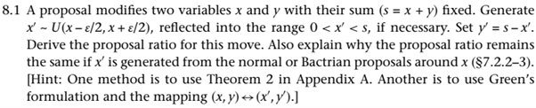

**Solution.**

Note that the proposal draws $x'$ from $[x - \frac{\epsilon}{2}, x + \frac{\epsilon}{2}]$, but restricts $x'$ to $(0,s)$ by reflecting any proposal that falls outside. Noting that the proposal is symmetric, we can see that $q(x \rightarrow x') = q(x' \rightarrow x) = \frac{1}{\epsilon}$. Thus, the Hastings ratio is $r = \frac{q(x \rightarrow x')}{q(x' \rightarrow x)} = 1$.

As an example, consider $x = 0.9$, $s = 1$, $\epsilon = 0.4$, $x' = 0.95$. Then, $x'$ is achieved by either a draw within $[0.9 - \frac{0.4}{2}, 1]$ whose probability density equals $\frac{0.3}{0.4} \times \frac{1}{0.3} = \frac{1}{0.4}$, or a draw within the reflection region, where the PDF = $\frac{0.1}{0.4} \times \frac{1}{0.1} = \frac{1}{0.4}$. Hence, $q(0.9 \rightarrow 0.95) = \frac{1}{0.4} + \frac{1}{0.4} = 5$. Likewise, we see $q(0.95 \rightarrow 0.9) = \frac{0.25}{0.4} \times \frac{1}{0.25} + \frac{0.15}{0.4} \times \frac{1}{0.15} = \frac{1}{0.4} + \frac{1}{0.4} = 5$.

In case where the proposal distribution is a normal distribution, we have

$$q(x \rightarrow x') = \sum_{k = - \infty}^{\infty} \left[ \mathcal{N}(x' + 2ks \mid x, \sigma^2) + \mathcal{N}(-x' + 2ks \mid x, \sigma^2) \right] = q(x' \rightarrow x).$$

To verify this, we again use the above example. We restrict the number of reflections to be two, such that for $x = 0.9$ and $x' = 0.95$, we have the following:

| Case              | y           | Reflections   | PDF                                     |
| :---------------- | :---------- | :------------ | :-------------------------------------- |
| No reflection     | 0.95        | N/A           | $\mathcal{N}(0.95 \mid 0.9, \sigma^2)$   |
| One reflection    | $-0.95$     | Reflect at 0  | $\mathcal{N}(-0.95 \mid 0.9, \sigma^2)$  |
| One reflection    | $2s - 0.95$ | Reflect at s  | $\mathcal{N}(1.05 \mid 0.9, \sigma^2)$   |
| Two reflections   | $0.95 - 2s$ | Reflect at 0, s | $\mathcal{N}(-1.05 \mid 0.9, \sigma^2)$  |
| Two reflections   | $2s + 0.95$ | Reflect at s, 0 | $\mathcal{N}(2.95 \mid 0.9, \sigma^2)$   |

and for $x = 0.95$ while $x' = 0.9$, we have the table below.

| Case              | y          | Reflections   | PDF                                     |
| :---------------- | :--------- | :------------ | :-------------------------------------- |
| No reflection     | 0.9        | N/A           | $\mathcal{N}(0.9 \mid 0.95, \sigma^2)$   |
| One reflection    | $-0.9$     | Reflect at 0  | $\mathcal{N}(-0.9 \mid 0.95, \sigma^2)$  |
| One reflection    | $2s - 0.9$ | Reflect at s  | $\mathcal{N}(1.1 \mid 0.95, \sigma^2)$   |
| Two reflections   | $0.9 - 2s$ | Reflect at 0, s | $\mathcal{N}(-1.1 \mid 0.95, \sigma^2)$  |
| Two reflections   | $2s + 0.9$ | Reflect at s, 0 | $\mathcal{N}(2.9 \mid 0.95, \sigma^2)$   |

Denote the number of reflections as $n$. Thus,

$$q_{n \leq 2}(x \rightarrow x') = \sum_{y \in \{\pm 0.95, \pm 1.05, 2.95\}} \mathcal{N}(y \mid 0.9, \sigma^2) = \sum_{y \in \{\pm 0.90, \pm 1.10, 2.90\}} \mathcal{N}(y \mid 0.95, \sigma^2) = q_{n \leq 2}(x' \rightarrow x).$$

For the Bactrian distribution, it is a 1:1 mixture of two normal distributions, and the same logic should apply. We leave this for the readers.
