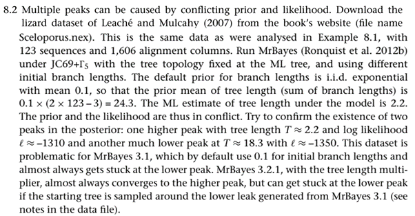

  

**Solution.**

Unfortunately, I see the version 3.1 of MrBayes at nowhere. If you
happen to know any old-fashioned Bayesian phylogenetics person who has not
updated their software for a decade, please let them know this exercise.
